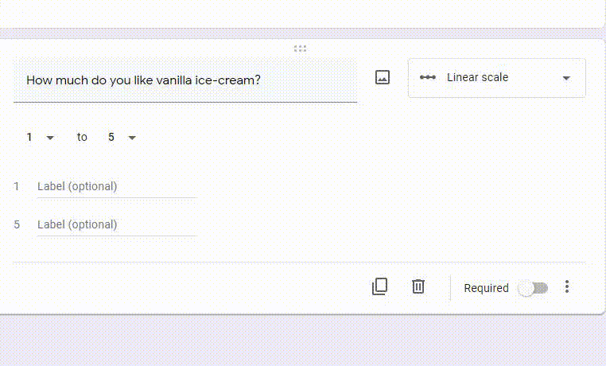
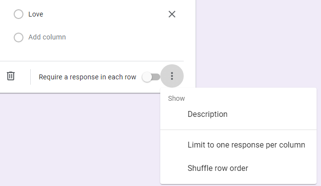

# Other Question Types

  This section will include information for other question types. For short answer and paragraph, go to sub-section A below. For multiple choice, checkboxes and dropdown, go to sub-section B below. For linear scale, multiple choice grid, and checkbox grid, go to sub-section C. For additional options, go to sub-section D.

  For steps to add a question or to select a question type, go to step 2 in the "Creating And Setting Up A Question".

## A. Short Answers and Paragraph

  These question types allow users to input their own answers instead of choosing from pre-set options.

### Short Answers

  This option is suitable for written responses in a few words. For example: "What is your name?" or "What is your email address?"

### Paragraph

  This option is suitable for long written responses over one or more paragraphs. For example: "Do you like ice-cream? Why or why not?"

## B. Multiple Choice, Checkboxes, and Dropdown

  These question types allow users to choose from a preset list of options that you make. For steps on how to add options for this type of question, go to step 3 from the "Creating And Setting Up A Question" page.

### Multiple Choice

  This option is suitable when _only one_ option should be chosen. The add "other" option which allow users to add their own answer is available to be added.

### Checkboxes

  This option is suitable when _more than one_ option can be chosen.

### Dropdown

  This option is suitable when _only one_ option should be chosen. The add "other" option which allow users to add their own answer is available to be added.

## C. Linear Scale, Multiple Choice Grid, Checkbox Grid

  These questions types are more advanced.

### 1. Linear Scale

  This option is suitable when you want your question to be rated on a scale. Your scale can start at 0 or 1, and can end on a whole number from 2 to 10. You can optionally add a label to each end of the scale to clarify how respondents should answer the question based on their opinion.

  1a. Enter your question. An example question: "How much do you like vanilla ice-cream?"

  1b. Click on the number that you want to change. The number on the left corresponds to the start of the scale, and the number on the right corresponds to the end of the scale.

  

  1c. This step is optional. Click on `Label` to add a label to your scale. It is recommended to add a label so users know what each end of the scale represents. For example, 0 is hate, and 10 is love. This is what the question should look like when we preview it.

  

### 2. Multiple Choice Grid and Checkbox Grid

  Grid questions are a quick way to help you ask the same question for series of different items. They are set up with rows and columns. Each row represents a single item users are asked to answer for. Columns are the choices people can select from.

  In a multiple choice grid, users can select only _one answer_ per row.

  Checkbox grid is similar to the multiple choice grid, except users can select _more than one answer_ per row.

#### Creating Multiple Choice Grid and Checkbox Grid Questions
  
  2a. Enter your question. An example question: "How much do you like each of the following ice-cream flavours?"

  2b. Click on "Row 1" to edit the first row. For additional rows, click on "Add row" to start typing. An example following the sample question from step 2a would be "Vanilla" and "Chocolate".

  2c. Click on "Column 1" to edit the first column. For additional columns, click on "Add column" to start typing. An example to the question on step 2a would be "Hate" or "Love"
  
  A completed multiple choice grid question would look like this:
  

## D. Additional Options

  Additional options are available help refine questions. 
  
  Click on the three dots on the bottom right of the question.
  A menu should appear:
  
  
  {: height="8%" width="8%" style="float: left"}
  **Note** Additional options vary by question. This beginners guide will describe the options shown in the image above.

### 1. Description

  Adding a description will help clarify your question.

  1a. Click on `Description`. A new area to input the description will appear. Click on `Description` to add details to your question.

  
  

### 2. Shuffle Row Order

  This option will randomize the row sequence for every user.

  2b. Click `Shuffle row order`.

### 3. Limiting response per column

  This option is only available for grid questions. Selecting this option will set a limit to one response per column. Each column may _only be selected once_ in the question. This is ideal for ranking and comparing rows against each other.

  3b. Click on `Limit to one response per column`.

  A example of a completed multiple choice grid question:
  

## Conclusion

  Each question type is effective in collecting data in different ways. It is important to consider which type of question is most appropriate for the data you are trying to collect. Remember each question has different additional options to aid in your gathering of data.