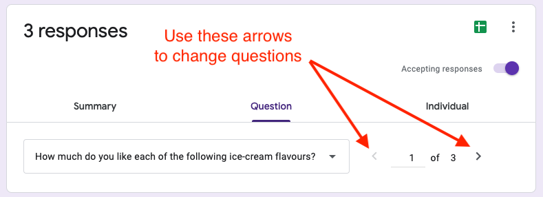

# Viewing Form Responses

{: .no_toc }

---

Congrats, you've now got your form all set up! But how do we view the responses? This guide will show you how to read through your responses.

## 1. Click on the `Responses` Tab

Near the top of the page, you may have noticed two tabs: `Questions` and `Responses`. You may also notice a number beside `Responses`. This number indicates how many completed responses your form has received.

## 2. Viewing Your Form Responses

There are three different choices on how you view your responses. Google Forms allows you to view a summary of all responses, responses by question, or responses by user. These three options will help you read through your data easily.

### Response Summary

If this is your first time selecting the `Responses` tab, you will be in the `Summary` section by default. If your form has received any responses, this page will display the general data for each question.

Depending on what type of question you created, the data may present itself as a graph, chart, list, or another format.

### Viewing Responses by Question

If you would like to view the responses for a single question, navigate to the `Question` tab.

Select which question's responses you want to view by clicking the left and right arrows to the bottom right of the `Question` tab.

### View Each User's Response

To view a single user's response, click on the `Individual` tab. Under this tab, you will be able to see what a user answered for all the questions.

Use the arrows to look through each response.

## Conclusion

That's it! Now you are able to look through all your form responses.
