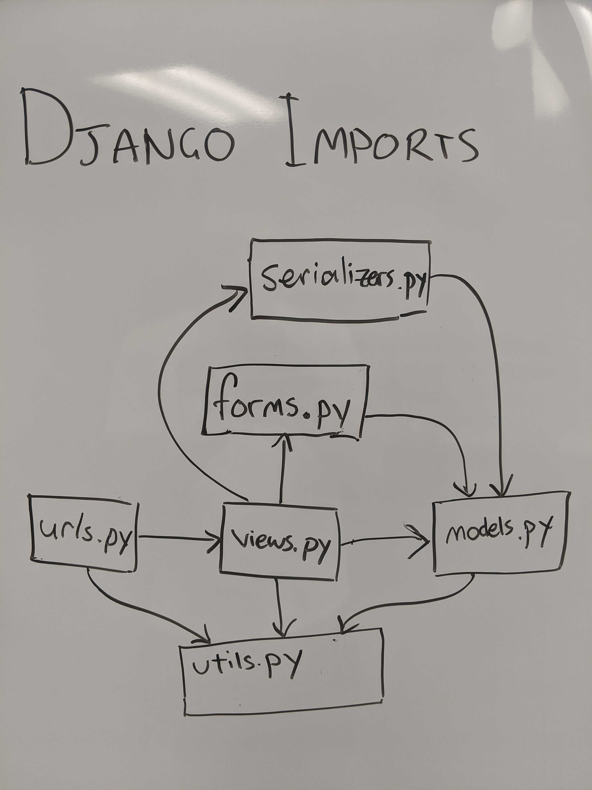

**Purpose**

To share things we've found to solve common issues with Django and save lots of time.

**Scope**

Covers numerous specific issues and makes overall recommendations.

## Client Cache Management

Include version string in static assets paths loaded from the client.

    

In `settings.py` set `VERSION=os.system('git rev-parse HEAD')`

This is a wonderful catchall to prevent client cache issues that waste
so much time.

## Use LTS Django

Use the long term support version of Django, ideally the latest one
available at any given time.

## Read 2 Scoops of Django

This book contains a lot of great practices, which we *almost*
universally agree with. In particular:

  - Fat models, skinny views. Put more logic and code in Model methods,
    if it's relevant to that model specifically. Avoid large amounts of
    code in views.

## Patterns

### Imports

Certain files in Django should only import from other certain types of
files. For example, `urls.py` should really only import from `views.py`
(and `utils.py`).

### Models

>   - Keep models *normalized*: no duplicate data or extra foreign keys.
>   - Schema changes should be reviewed by a senior dev, as any bad
>     designs here will cascade to other layers.

### Views

>   - We generally use function based views (FBV) instead of class based
>     views (CBV) at Countable.
>   - When using Django Rest Framework (DRF), this is an exception and
>     we prefer CBV. Please do use DRF for substantial rest API work.
>   - Keep views small. It's better to put logic in Models or other
>     shared modules outside the views.
>   - Avoid unnecessary nesting.

    #unnecessary nesting:
    def view(request):
        if 'x' in request.GET:
            if (another check):
                return HttpResponse(...)
    # better
    def view(request):
        if 'x' not in request.GET:
            return Http400(...)
        if not another check:
            return Http400(...)
        return HttpResponse(...)

### Guidelines

>   - Use help\_text in your models
>     because it helps both devs and users in the `/admin` . ie) `color
>     = models.CharField(help_text="Your primary brand color as a hex
>     code, ie) #FF0000")`

### Timezone Management

  - Timezones are a complicated aspect to manage. After working on this
    on some large projects, here are recommendations:
    
      - You should usually avoid DateField, and it's better to store
        DateTimeField because then we can switch timezones later on if
        needed. Most events do have time at which they occurred, and
        that should be stored.
      - Store Datetimes in the database in UTC.
      - Only convert to a specific timezone at the View/Template layer
        (when rendering or collectin information from the user).

### Managing Environments

  - Django should have SMTP creds, and should set the ADMINS to the
    back-end developer that maintains that project. Or, use sentry\_sdk
    with sentry.countable.ca
  - In prod and staging environments, set DEBUG=False, so the ADMINS get
    emails with any stack traces.
