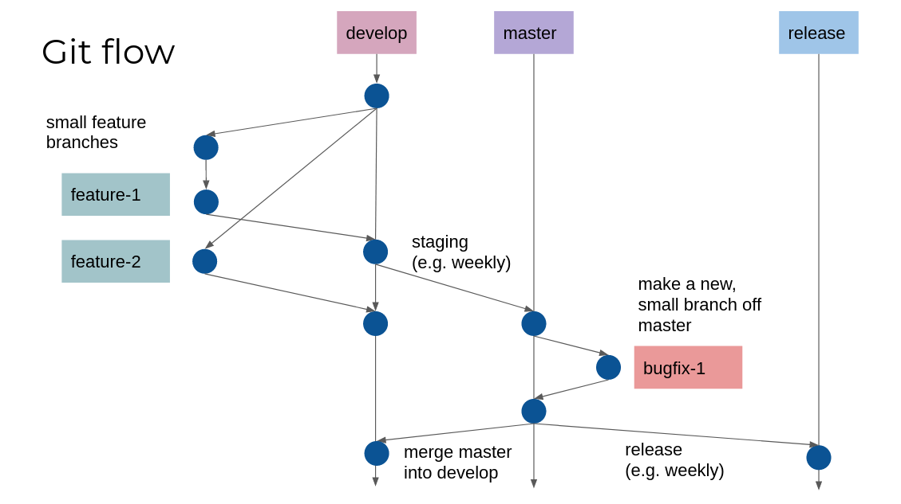

# Git

**Purpose**

Outlining the norms of git collaboration at Countable.

**Scope**

Broad coverage of multiple elements of git workflow.

## Git Branches

Countable uses [git flow](https://jeffkreeftmeijer.com/git-flow/) for
branch naming.

1.  `develop` is the main branch developers work on and test.
2.  `master` is the stable branches released to production. (most
    projects do not use release branches, we just continuously deploy
    `master`)
3.  `feature/my-feature-name` feature branches contain your work for up
    to one day, before being merged back into `develop`.
4.  `hotfix/my-bug-name` hotfix branches are merged into `master` to fix
    urgent problems in production.

Our feature branches are owned by a single person and very
short-lived,see [trunk based development](https://paulhammant.com/2013/04/05/what-is-trunk-based-development/).
From the latter:

> You should do Trunk-Based Development instead of GitFlow and other
> branching models that feature multiple long-running branches. You can
> either do a direct to trunk commit/push (v small teams) or a
> Pull-Request workflow, as long as those feature branches are
> short-lived and the product of a single person.

## Contributing To A Project

1.  Check out `develop` and make a branch from that.

<!-- end list -->

    git checkout develop
    git checkout -b feature/fireball-spell

2.  Do your work, commit, update, push.

<!-- end list -->

    git commit -a -m "Added the Fireball ability to wizards, Trello ticket #51"
    git pull origin develop
    git push origin feature/fireball-spell

(Git will print out a link in the terminal that you may open to quickly
create a pull request.)

3.  Test that your changes dont't break anything.

Run automated tests and check things you know other team members are
actively working on still work.

4.  Submit a pull request from `fireball-spell` targeting `develop`.

Another developer on the project should [review](#code-reviews) and
comment on your changes. When everyone agrees, anyone can merge the
changes. The `fireball-spell` branch is then deleted after being merged.

## Hotfix

If production is broken, you want to fast-track a fix into master.
**Only for emergencies**. Your PR will be made against master instead of
develop in this case.

## General GIT Guidelines

  - Commit often (\~hourly), with each logical change in its own commit.
    If for no other reason, developers who commit multiple times per day
    are nearly 10% more likely to be satisfied with their jobs (Stack
    Overflow dev survey, 2017). That's one crazy correlation for such a
    simple behaviour\!
  - Push often, and merge into `develop` every day. You will need to
    structure your work in a way that avoids long-lived branches: Use
    feature flags, comment out broken tests, leave "TODO" notes, and
    hide functionality in the UI if it's not ready yet.
  - Use the "imperative voice" for commit messages: *Verb* *noun*. ie)
    "Remove magic glyphs from wizard profile card."
  - Don't commit example code. Remove or gitignore it.
  - Don't commit commented code, unless you have another English comment
    above it explaining why it's commented out, and not deleted.
  - Use Trunk Based Development. Your feature branches should be merged
    into `develop` within a day of being created.
  - Unfinished things (links that go nowhere, or Lorem Ipsum) we don't
    want to show up live should be deleted, fixed, or commented out.
    Leave an additional comment indicating why they're commented out if
    you do the latter. These things are fine to commit, but before you
    do a Pull Request, please review your own code and clean it up so
    it's something you're proud to show your team.
  - When merging, check you've not missed any merge markers still in
    unmerged files. `grep -r ">>>>>" .` will normally do this for you
    for example.
  - We use the "monorepo" pattern, which means it's better to have one
    large repo for an entire project. Not multiple small ones for
    components.
  - Be careful when merging in the upstream (develop) branch that you
    don't overwrite anyone else's changes with yours. It pays to look
    closely at each merge marker. Use a [3way merge tool](https://www.youtube.com/watch?v=GiXGYQ9Ah0U) `git mergetool`
    if the merge is nontrivial.

## Tips for Creating A Pull Request

When you create your pull request:

  - Review it on BitBucket yourself because it lets you find embarassing
    mistakes without your team seeing them ;)
  - Comment on specific lines you want the reviewer to notice.
  - Check the checkbox option to automatically delete the branch after
    merge. You can merge right away, no approval required.
  - Code reviews are *not a gate* for deployment. The submitter merges
    the code at any time based on the team's needs. Communicate about
    what you're doing. If code is merged before you review, the reviewer
    can still add comments and changes can be patched in as needed.
  - Do not merge unless the tests are passing. Don't break the tests in
    `develop`. If you do, fix them ASAP because other devs will be
    unable to test their work otherwise.

## Tips for Code Reviews

When a pull request is created, several people are set to automatically
review.

  - The main goal of code reviews is for everyone to learn from each
    other. So, ask your questions and discuss using the pull request
    comments\!
  - It's a good idea to review code within 2 days of it being written,
    because then the author has it fresh in their mind and can make
    corrections easily based on your suggestions.
  - It's up to the reviewer's judgement how much time they spend on a
    code review. It could be quick or more in-depth.
  - The reviewer should understand what the code is doing. If it's
    unclear, ask in a review comment what it does.
  - Reviewer should point out anything that's not following project
    conventions. Are we doing something a new way, when a perfectly good
    way existed before?
  - Try to find and remove any duplicate code (DRY) or dead code.
  - Review these [Code Review Guidelines](https://phauer.com/2018/code-review-guidelines/)
  - If you review code, always indicate you did so. Either click
    "approve", or leave a comment.
