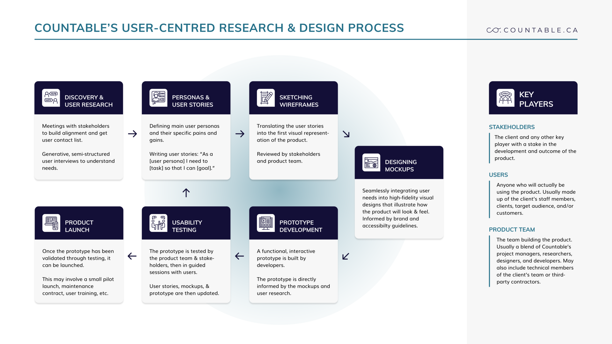

# UX Design Process
{: .no_toc }

## Table of Contents
{: .no_toc .text-delta }

- TOC
{:toc}

**Purpose**

To explain the Human Centered Design approach Countable takes to its user experience process.

**Scope**

Gives an overview of our three-phase process, and describes the many tools we use throughout that process.

## Process Overview

There are three major phases: User Research, Prototyping and Feedback. 

These will overlap and repeat to some extent.

### User Research

It's valuable to front-load much of the user research in a software project so other work can be informed by information about real users, not our assumptions.

 

#### Persona Development

First, identify the people who will interact with the work product (Personas). 

Ideally, find a real person who embodies each persona and stay in contact with them to collect feedback throughout the product development.

Make a list of personas, and use those persona names consistently from now on.

#### Interviews

Interview representatives of each Persona to answer the following:

  - What problem are you solving for the persona? 
    - Why does that problem matter to them?
    - What words do they use to describe the problem?
  - What is your Persona currently doing about this problem (prior to your solution)?
  - Take advantage of your "fresh eyes" at this time, to identify needs the user might have that they're not consciously aware of.
    - It's fine if you turn out to be wrong about these, just write them down to validate later.

#### Other Research

Interviews should be the primary source of information about your users, but you may *supplement* this with surveys, anecodotes from your product owner (the client, most often) and other data sets to inform stories.

#### Stories

  - Write user stories. This is a functional spec of your software. Be clear about what it should do for users.
  - Validate your stories with the product owner and users, and adjust.

## Prototyping

It's beneficial to involve your personas and other stakeholders in the below steps where practical (co-design workshop). This speeds up the "validation" step, below.

  - For any project with a user interface, create wireframes that support the important user stories. 
  - Validate these against conversations with the target market.

Depending on the project, you may also want to develop:

  - For projects with nontrivial sequences of interactions over time, consider a customer journey map, or process diagram (BPD).
  - For projects with many user interfaces or many views, develop an Information Architecture diagram to show how different user interfaces are linked.
  - For projects with nontrivial off-screen actions, consider storyboarding the actions a user must take related to their use of the product.
  - Other project-specific resources as needed to get everyone on the same page about any aspect of the user experience which is important to more than one the stakeholders.

### Validation

  - Validate your wireframes and other planning materials with the product owner and users, adjust, and repeat until everyone on your team has a clear shared vision.
  - You're now ready to hand off the wireframes to technical team members to build a functional [prototype](../../developers/PROTOTYPING/).

## Feedback

While user experience design can be front-loaded in a project somewhat, it's critical to continue throughout the project to ensure incremental improvements are made and a great end result is achieved.

  - Conduct [usability tests](USABILITY_TESTING.md) of the functional prototype as you iterate on it, each sprint.
  - Perform follow-up interviews on users after they've tried the product.
  - Build a feedback mechanism (chat widget, form, etc) into the User Interface for a quick easy way to get contextual feedback from users.
  - Ensure developers understand the critical user flows in order to align with acceptance criteria for automated tests.
